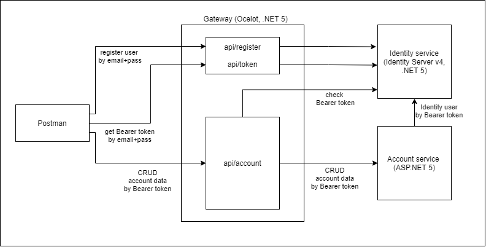

# Домашнее задание (Занятие № 12)
## Backend for frontends. Apigateway

1. Архитектурное решение и схема отправки запросов представлена на картинке ниже.


2. Установку приложения можно осуществить одним из двух способов:
- Полная установка с настройкой Prometheus, Grafana и Ingress. В этом случае создается `namespace otus-services`, в котором должно находится приложение, т.к. на него настроен Gateway. Для установки нужно выполнить скрипт, находясь в директории `lesson-12`:
```shell
lesson-12 > ./install.sh
```

- Установка только бизнес-сервисов из helm-чартов, для этого руками нужно создать `namespace otus-services`. Для установки нужно выполнить скрипт, находясь в директории `lesson-12/helm`:
```shell
lesson-12/helm > ./install.sh
```

Для работы Gateway во время установки чартов выполняется настройка [Permissive RBAC Permissions](https://kubernetes.io/docs/reference/access-authn-authz/rbac/#permissive-rbac-permissions).

3. После того, как все сервисы будут установлены и запущены можно выполнить тесты Postman, выполнив команду:
```shell
lesson-12 > newman run tests/Otus.postman_collection.json
```
Переменная `{{baseUrl}}` настроена на домен `arch.homework`.