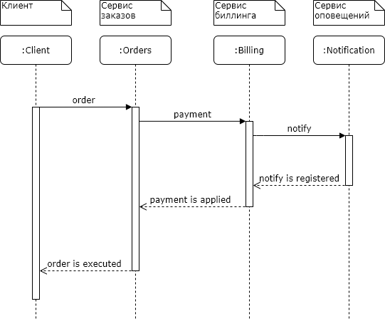

# Домашнее задание (Занятие № 16)

## Stream processing

### Теоретическая часть

Спроектировать взаимодействие сервисов при создании заказов. Предоставить варианты взаимодействий в следующих стилях в виде sequence диаграммы с описанием API на IDL:

1. Только HTTP взаимодействие.


1. Cобытийное взаимодействие с использование брокера сообщений для нотификаций (уведомлений)


1. Event Collaboration cтиль взаимодействия с использованием брокера сообщений


> Для выполнения текушей задачи выберем **второй метод**.

Файлы OpenAPI спецификаций представлены по [ссылке](/openapi/).

### Практическая часть

Итоговая схема системы приведена ниже


#### 1. Установку приложения можно осуществить одним из двух способов

- Полная установка с настройкой Prometheus, Grafana и Ingress. В этом случае создается `namespace otus-services`, в котором должно находится приложение, т.к. на него настроен Gateway. Для установки нужно выполнить скрипт, находясь в директории `lesson-16`:

```shell
lesson-16 > ./install.sh
```

- Установка только бизнес-сервисов из helm-чартов, для этого руками нужно создать `namespace otus-services`. Для установки нужно выполнить скрипт, находясь в директории `lesson-16/helm`:

```shell
lesson-16/helm > ./install.sh
```

> Для работы Gateway во время установки чартов выполняется настройка [Permissive RBAC Permissions](https://kubernetes.io/docs/reference/access-authn-authz/rbac/#permissive-rbac-permissions).

#### 2. После того, как все сервисы будут установлены и запущены можно выполнить тесты Postman, выполнив команду

```shell
lesson-16 > newman run tests/otus.postman_collection.json
```

Переменная `{{baseUrl}}` настроена на домен `arch.homework`.
